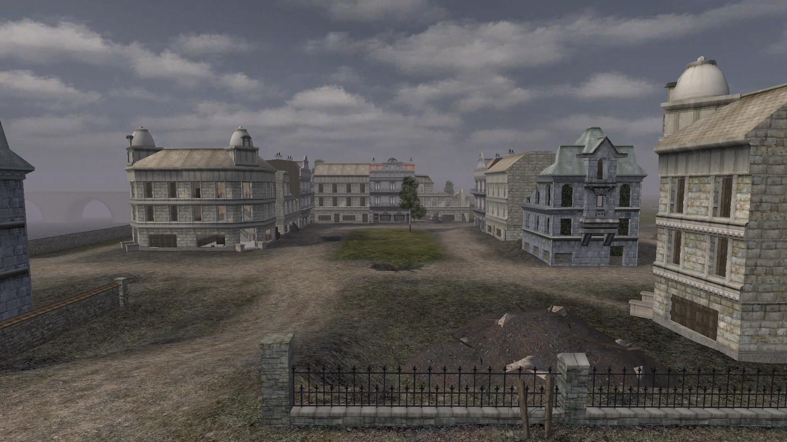
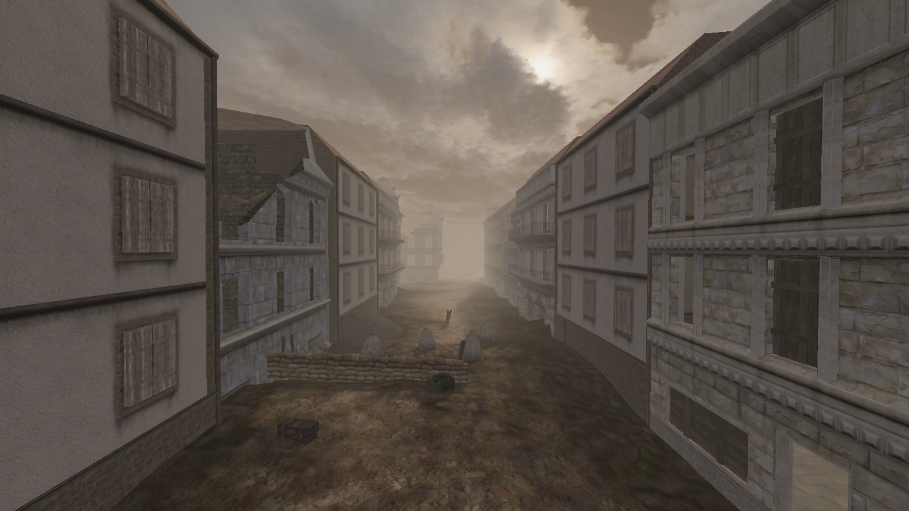
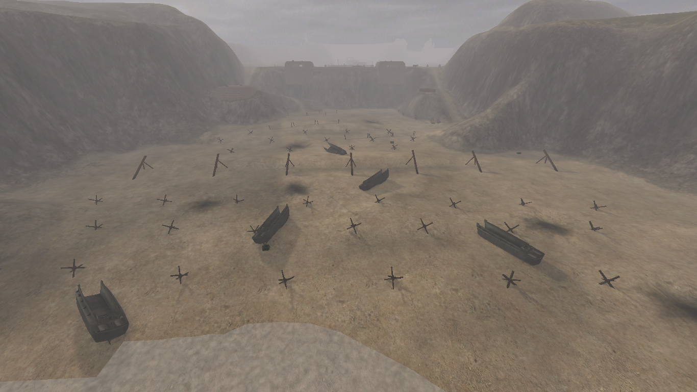
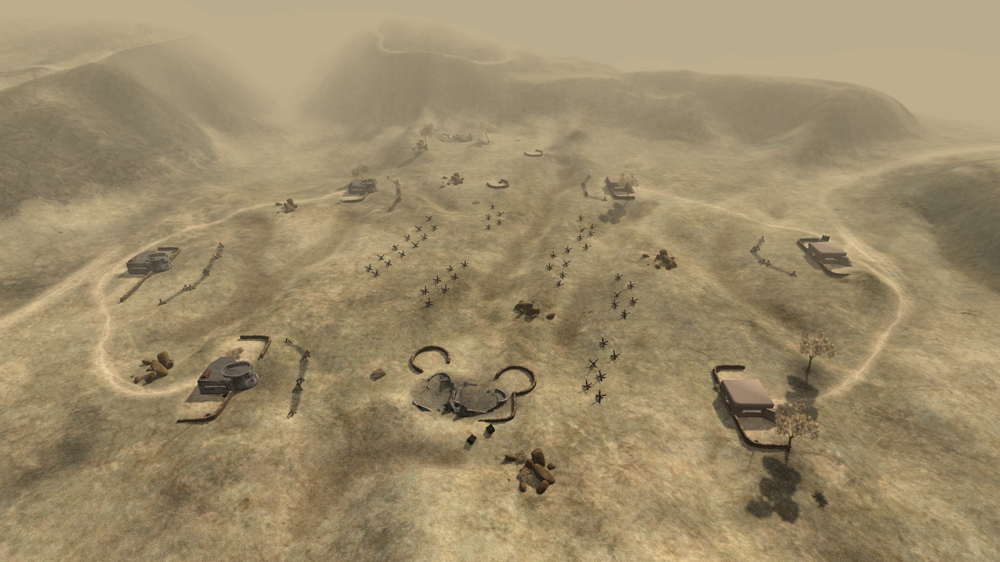

# OpenField42


~~*The project is currently on hold because I’m focusing on smaller projects right now. I will definitely return to OpenField42 later — it’s my passion project. In the meantime, contributions and stars are highly appreciated ❤*~~

*I'm back... maybe =)*

## 🚀 Overview

**OpenField42** is an ambitious, open-source re-implementation of the classic **Battlefield 1942** game engine, primarily developed by a single contributor in modern C++.

My goal is to create an engine that can fully reproduce the original game by utilizing its proprietary asset files, thereby overcoming the technical limitations of the legacy engine. Ultimately, I aim to provide the community with a stable, modern, and robust platform for advanced modding, much like what **OpenMW** did for *Morrowind*.

> *"I just love Battlefield 1942 and want to revive it. This project is my attempt to bring the game into the modern era and provide the necessary tools for the community to keep it alive."*

---

## 📸 Gallery / Visual Progress

Here are a few screenshots showcasing the current rendering progress across different BF1942 maps:

| Map | Image |
| :---: | :---: |
| **Market Garden** |  |
| **Berlin** |  |
| **Omaha Beach** |  |
| **Battleaxe** |  |

---

## ✨ Current Status & Features

The project is currently in the **Pre-Alpha** stage. While highly functional, development is temporarily paused as I am focusing on other work.

## 📊 Detailed Progress Tracker

| Category                  | Feature                                      | Status     | Notes |
|:--------------------------|:---------------------------------------------|:----------:|:------|
| **Asset Loading**         | .rfa archives (librfa)                       | [x]       | Full read support |
|                           | .con scripts                                 | [x]       | Parsed and loaded |
|                           | Textures (.dds)                              | [x]       | All formats supported |
|                           | StandardMesh (.sm)                           | [x]       | Static objects |
|                           | TreeMesh (old vegetation format)             | [ ]       | Top priority right now |
|                           | .ske & .skn (model skeleton?)                | [ ]       | |
|                           | .baf (primary animation files?)              | [ ]       | |
| **World Rendering**       | Heightmap terrain + detail textures          | [x]       | |
|                           | Skybox                                       | [x]       | |
|                           | All static objects                           | [x]       | |
|                           | Alpha sorting & transparency                 | [x]       | |
|                           | Level of Detail (LOD) system                 | [x]       | |
|                           | Frustum culling                              | [x]       | |
|                           | Vegetation (trees, bushes, grass)            | [~]       | Loads positions, missing meshes |
|                           | Water planes                                 | [~]       | Visible but very flat + simple animation |
|                           | Water reflection / refraction                | [ ]       | |
|                           | Lighting                                     | [~]       | Objects too bright right now |
| **Core Systems**          | Free-fly debug camera                        | [x]       | WASD + mouse look |
|                           | Input system (SDL3)                          | [x]       | |
|                           | Physics                                      | [ ]       | |
|                           | Player / soldier controller                  | [ ]       | |
|                           | Vehicles                                     | [ ]       | |
|                           | Weapons & projectiles                        | [ ]       | |
| **AI**                    | Bots                                         | [ ]       | |
| **Networking**            | Multiplayer (Refractor 1 protocol)           | [ ]       | Long-term goal |
| **Audio**                 | Sound loading & playback                     | [ ]       | Not started |
| **Tools & Debug**         | Dear ImGui overlay                           | [x]       | |
|                           | Profiler (F3)                                | [x]       | |
|                           | Wireframe mode (F1)                          | [x]       | |
|                           | Fullscreen toggle (F11)                      | [x]       | |
| **Platform**              | Linux                                        | [x]       | Primary |
|                           | Windows                                      | [x]       | Tested |
|                           | macOS                                        | [ ]       | Should work, untested |

**Legend**  
[x] = Done  [~] = Partially working / WIP  [ ] = Not started

**What you can do right now**  
Launch any original BF1942 map and freely fly around it. You’ll see terrain, sky, all buildings and static objects with proper LODs and frustum culling.

## 🤝 Contribution

While I am the primary developer, this is an open-source project, and **help is highly encouraged and needed!** If you are passionate about BF1942 and C++ development, please consider contributing. Any help with implementation, bug fixing, or documentation would be greatly appreciated to accelerate the project's progress.

## 🛠️ Technology Stack

The project is built on modern, cross-platform technologies:

* **Language:** C++
* **Windowing/Input:** [SDL3 (Simple DirectMedia Layer)](https://www.libsdl.org/)
* **Graphics:** [GLAD (OpenGL Loading Library)](https://github.com/Dav1dde/glad)
* **Debugging/Tools:** [Dear ImGui](https://github.com/ocornut/imgui)
* **Archiving:** [librfa](https://github.com/c0d3m4nc3r/librfa) (My custom library for RFA file handling)

## ⚙️ Build Instructions

OpenField42 uses a straightforward CMake-based build process. All necessary third-party libraries (including SDL3) are automatically fetched during configuration using CMake's `FetchContent`.

### Prerequisites

* **Git**
* **CMake** (version 3.25 or higher)
* A modern C++ compiler (e.g., GCC, Clang, MSVC)

### Steps

1.  **Clone the repository:**
    ```bash
    git clone https://github.com/c0d3m4nc3r/OpenField42
    cd OpenField42
    ```

2.  **Configure and Build:**
    ```bash
    cmake -B build
    cmake --build build
    ```

### Supported Platforms

* **Linux** (Primary Development Platform)
* **Windows**

## 🕹️ Usage (Running the Game)

To run OpenField42, you must provide the original Battlefield 1942 game files:

1.  **Create the Data Directory:** In the root directory of the project, create a new folder named `game_data`.
    ```bash
    mkdir game_data
    ```

2.  **Copy Game Files:** Copy the **entire** `bf1942` **mod folder** (usually located inside the `Mods` directory of the original game installation, e.g., `.../Battlefield 1942/Mods/bf1942`) into the newly created `game_data` folder.

    > **Resulting structure should look like this:**
    > ```
    > OpenField42/
    > ├── game_data/
    > │   └── bf1942/  <-- The entire mod folder is here
    > ├── build/
    > └── ...
    > ```

3.  **Run the Executable:**
    The executable will be located in the `bin/` directory.

    * **With arguments:** Launch a specific map by passing its name:
        ```bash
        ./bin/of42 Market_Garden 
        ```
    * **Without arguments:** The engine defaults to loading the **Market Garden** map.
        ```bash
        ./bin/of42
        ```
    
    *On Windows, the commands may differ.*


## ⌨️ Controls (Debug/Free-Cam)

Since the core gameplay is not yet implemented, the engine currently utilizes debug controls for free camera movement and visualization toggles:

| Key(s) | Function |
| :--- | :--- |
| **WASD** | Move camera forward, backward, left, and right. |
| **Space** | Move camera up. |
| **Shift** | Move camera down. |
| **Mouse Wheel** | Increase/decrease camera speed. |
| **ESC** | Toggle cursor capture/lock. |
| **F1** | Toggle Wireframe mode. |
| **F3** | Toggle Profiler display (shows simple performance metrics). |
| **F5** | Reload certain resources (currently shaders). |
| **F11** | Toggle Fullscreen mode. |

## ⚖️ License

This project is distributed under the **GNU General Public License, Version 3 (GPLv3)**.

*This license was chosen due to compatibility with the `minilzo` library used in the project, which is licensed under GPLv2.*
